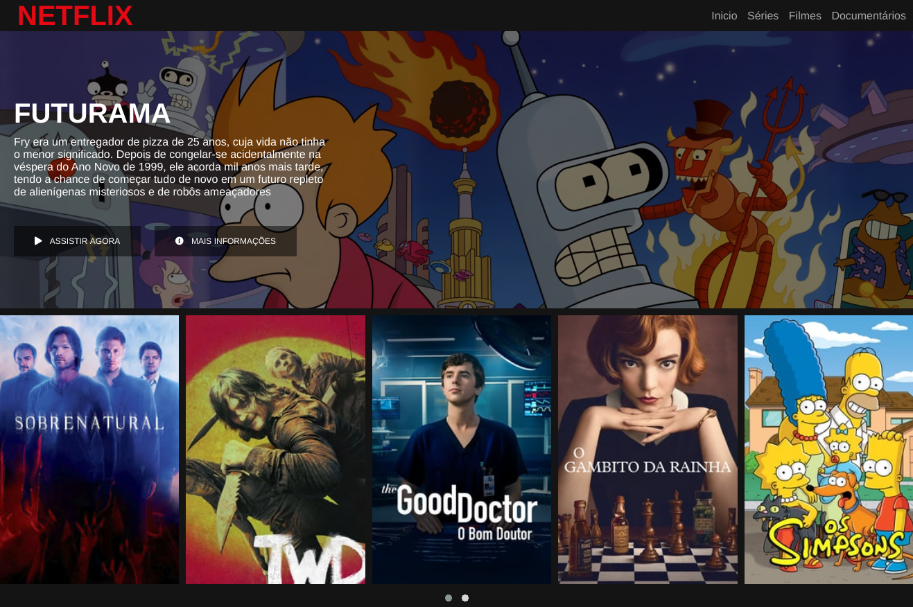

# Netflix clone

Clone da interface da Netflix feito no bootcamp da Digital Innovation One.

## Setup

Para usar o servidor de desenvolvimento, você vai primeiro precisar do NodeJs instalado em sua máquina e depois usar esses comandos na pasta do projeto:

1. `npm install` - para instalar as dependências.
2. `npm run server` - para iniciar o servidor.

